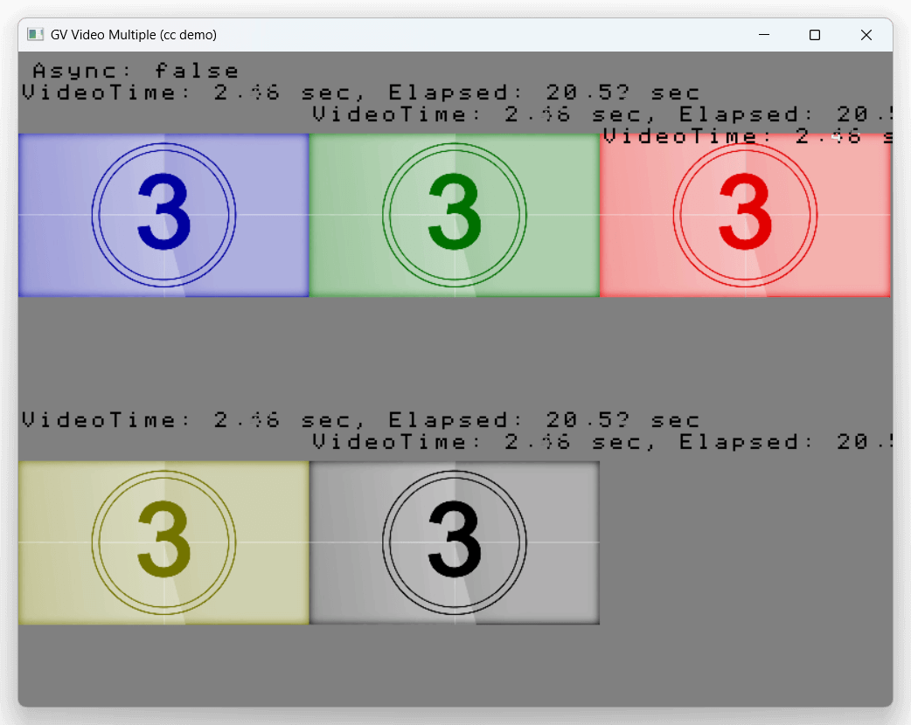

# GV video player for [odin-cc](https://github.com/cc4v/odin-cc)



## Examples

```bash
$ odin run examples/single
$ odin run examples/multiple

# NOTE: you can pass your gv files
$ odin run examples/single -- your_file.gv
$ odin run examples/multiple -- file1.gv file2.gv file3.gv ...
$ odin run examples/multiple -- your_dir_containing_gv_files
```
